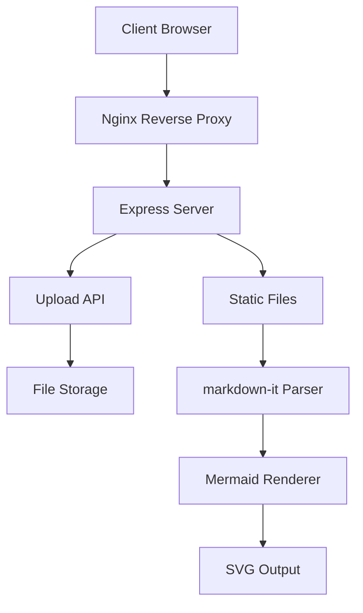
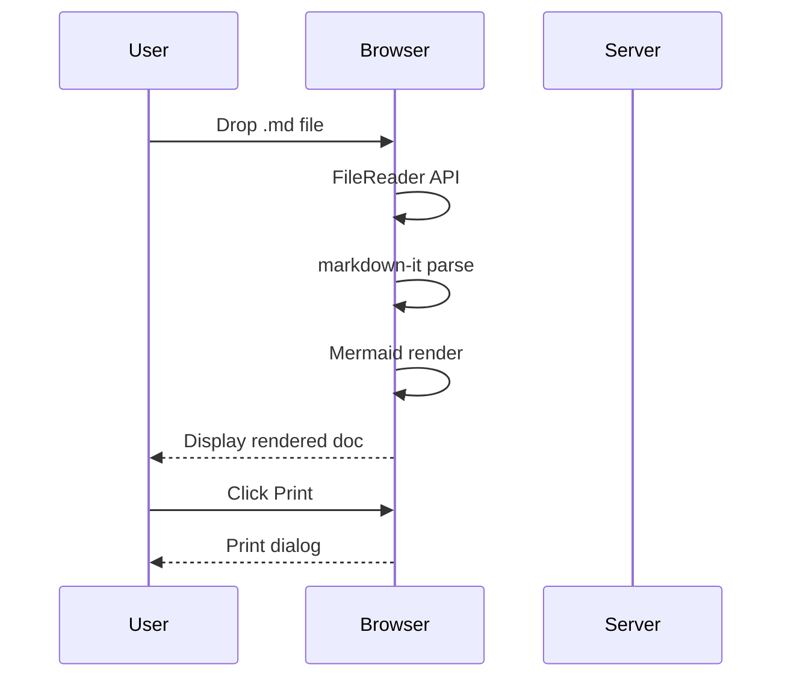

# MermaidDoc 테스트 문서

이 문서는 **MermaidDoc Viewer**의 기능을 테스트하기 위한 샘플입니다.

## 아키텍처 개요

아래 다이어그램은 시스템의 전체 아키텍처를 보여줍니다:



## 시퀀스 다이어그램

파일 업로드 및 렌더링 플로우:



## 일반 코드 블록

```javascript
const express = require('express');
const app = express();
app.listen(3000, () => {
  console.log('Server running');
});
```

## 표 예시

| 기능 | 상태 | 비고 |
|------|------|------|
| Markdown 렌더링 | ✅ 완료 | markdown-it 사용 |
| Mermaid 시각화 | ✅ 완료 | 직선 스타일 적용 |
| 다크 모드 | ✅ 완료 | 토글 지원 |
| 인쇄 지원 | ✅ 완료 | @media print 최적화 |

## 인용문

> MermaidDoc은 Notion 스타일의 깔끔한 다이어그램 렌더링을 제공합니다.
> 직선 기반의 포멀한 스타일로 문서의 가독성을 높입니다.

---

*MermaidDoc v1.0 — Markdown + Mermaid Visualization Engine*
